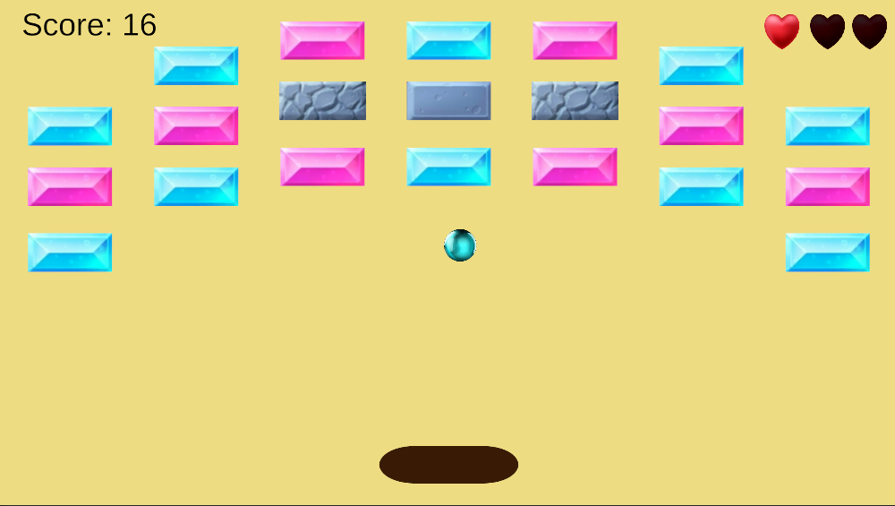
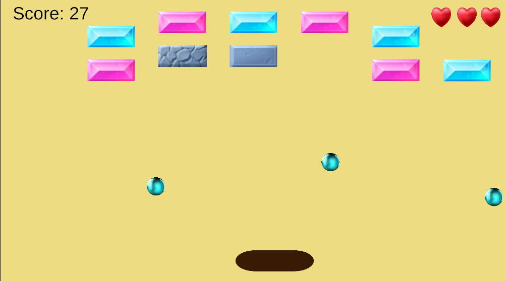
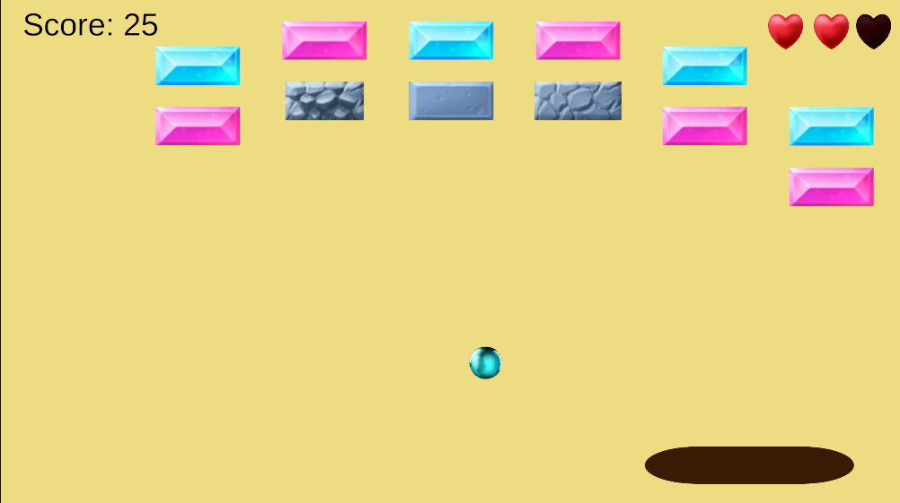
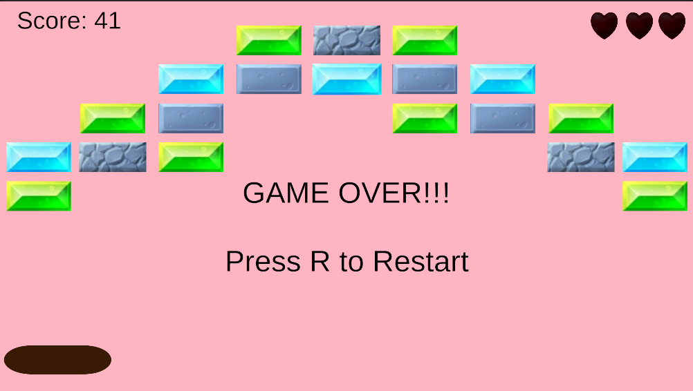

# 🧱 Breakout

A classic **Breakout-style arcade game** built in **Unity and C#**, featuring multiple levels, power-ups, destructible bricks, persistent score and lives, and progressively challenging gameplay.

The project started as a recreation of the classic Breakout formula and was expanded with additional gameplay systems to create a more complete multi-level arcade experience.

  

---

## 🎮 Game Overview

Control the paddle, keep the ball from falling, and destroy every brick to clear each level.

As you progress, the game introduces tougher brick layouts and different brick types, while power-ups can dramatically change the way you play.

The goal is simple:

> **Break every brick. Don't lose all your lives. Clear all three levels.**

---

## ✨ Key Features

### 🗺️ 3 Playable Levels

The game contains **three distinct levels**, each requiring the player to clear a new brick layout.

Progression between levels provides a sense of advancement rather than simply replaying the same board.

* Level 1 → Level 2 → Level 3
* Each level has its own brick arrangement
* Progression is triggered after clearing the current level
* Player **score and lives carry across levels**

---

### 🏓 Wide Paddle Power-Up

Collecting the **Wide Paddle Power-Up** increases the paddle's width, giving the player a larger area to work with.

This provides a temporary advantage and makes recovering difficult balls easier.

---

### ⚪ Three-Ball Power-Up

The **Three-Ball Power-Up** introduces two additional balls into play.

Instead of controlling a single ball, the player can have **three balls active simultaneously**, allowing multiple parts of the brick formation to be attacked at once.

This creates much faster and more chaotic gameplay compared to the normal single-ball state.

---

### 🧱 Multi-Hit Bricks

Not every brick breaks in one hit.

The game includes:

* **1-hit bricks**
* **2-hit bricks**
* **3-hit bricks**

Higher-hit bricks require repeated impacts before being destroyed, adding another layer of challenge and making later layouts more interesting.

---

### 🏆 Persistent Score System

The player's score is maintained throughout the entire game.

Breaking bricks contributes to the score, and the score continues to carry over when progressing between levels.

This allows the player to build a single overall score rather than having their progress reset after every level.

---

### ❤️ Lives System

The player has a limited number of lives.

When the ball is lost, a life is deducted rather than immediately ending the game.

Lives also persist across level transitions, making them an important resource throughout the entire run.

Lose all your lives, and it's **Game Over**.

---

## 📸 Screenshots

### ⚪ Three-Ball Power-Up

### 🏓 Wide Paddle Power-Up

### 🗺️ Level 3

---

## 🛠️ Built With

* **Unity**
* **C#**
* **Unity 2D Physics**
* **Unity UI**
* **Scenes & Scene Management**
* **Prefabs**
* **Collision & Trigger Detection**

---

## 🧠 What I Worked On

This project was an opportunity to move beyond basic player movement and practice building a game around **interacting gameplay systems**.

Some of the main systems implemented include:

* Multi-level game progression
* Persistent game state between scenes
* Score management
* Lives management
* Brick health / multi-hit behaviour
* Power-up spawning and effects
* Multiple simultaneous balls
* Paddle size modification
* Game-over and restart flow
* Level completion detection
* UI updates based on gameplay state

A major part of the project was making sure systems such as **score and lives don't reset when moving between levels**, allowing the three levels to function as one continuous game rather than three separate scenes.

---

## 📚 Project Purpose

This project was built as part of my journey learning **Unity game development and C# programming**.

Rather than stopping at a basic Breakout recreation, I expanded the game with multiple levels, persistent progression, power-ups, multi-hit bricks, and gameplay state management.

It helped me practice turning individual mechanics into a **complete playable game with interconnected systems**.

---

## 👤 Developer

**Gati**

Game Development Student | Unity & C#

This project is part of my growing collection of Unity game development projects.
